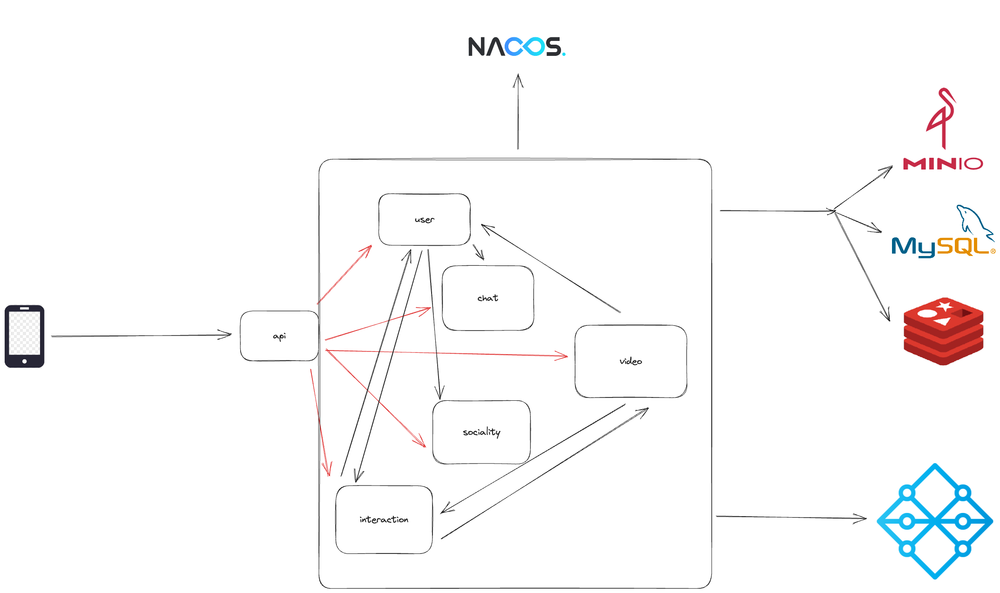

# GoYin
第六届字节跳动青训营后端极简版抖音

实现了用户功能，互动功能，社交功能，视频功能，聊天功能

## 项目特点

### 易维护

· 日志全覆盖，额外日志组件实现日志过滤，日志可视化，日志分类提取有效信息

· 可观测组件实现链路追踪，数据监控并实现可视化

· 采用微服务框架，并实现消息队列，实现结构解耦化

· 使用配置中心对配置文件进行统一管理，可进行版本回溯和监听查询

### 高可用

· k8s集群部署，实现高可拓展性

· 消息队列实现流量削峰，减小流量压力

· 实现了限流，熔断

### 高性能

· 采用kitex和hertz，高性能的微服务框架

· 适当使用并发处理减少请求时间

· 消息队列实现聊天消息处理

· 对象存储数据库存储视频和视频封面，节省了服务器资源

### 可靠性

· 敏感信息加密加盐处理

· 对敏感信息进行屏蔽过滤

· 具备CI功能，对整体项目代码进行了高覆盖率的单元测试和性能测试

· k8s集群搭建项目，具备容错性，支持横向拓展使项目管理更加便捷，负载均衡

## 功能介绍

· 基础接口：

​	· 视频流接口

​	· 用户注册接口

​	· 用户登录接口

​	· 用户信息

​	· 视频投稿

​	· 发布列表

· 互动接口：

​	· 赞操作

​	· 喜欢列表

​	· 评论操作

​	· 视频评论操作

· 社交接口：

​	· 关系操作

​	· 用户专注操作

​	· 用户粉丝操作

​	· 用户好友列表

​	· 消息：

​		· 聊天记录

​		· 用户好友列表

### 目录结构

​		。。。

## 代码架构图

​		

## 技术栈

微服务框架：hertz，kitex

配置中心：nacos

服务注册中心：nacos

消息队列：nsq

数据库：mysql，redis，minio

可观测性组件：jaeger，victoria-metrics，grafana

日志组件：logstash，elasticsearch，kibana

云原生技术栈：k8s，docker，nginx-ingress

## 具体功能

### 数据库

#### mysql

#### redis

#### minio

### nacos

### 可观测性

### 日志

### k8s

## 测试

## 鸣谢
